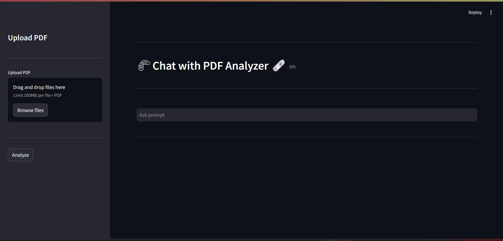

# PDF Analyzer Chatbot



## Overview

The **PDF Analyzer Chatbot** is a powerful tool that enables users to upload PDF documents, extract their content, and interact with an AI chatbot to get answers based on the document's content. This project leverages advanced AI models from Google, efficient text processing, and an interactive web interface built with Streamlit.

## Features

- **PDF Upload & Text Extraction**: Upload multiple PDF files and extract text seamlessly.
- **Text Chunking**: Efficiently manage large documents by splitting text into chunks.
- **Vector Store Creation**: Store and retrieve document information using FAISS and advanced embeddings.
- **Conversational AI**: Use Google's Gemini Pro model to provide accurate and context-aware answers.
- **Interactive Interface**: User-friendly interface built with Streamlit for easy interaction.

## Installation

### Prerequisites

- Python 3.7 or later
- Virtual environment (recommended)
- API key for Google Generative AI

### Steps

1. **Clone the Repository:**

    ```bash
    git clone https://github.com/your-github-username/pdf-analyzer-chatbot.git
    cd pdf-analyzer-chatbot
    ```

2. **Create and Activate a Virtual Environment:**

    ```bash
    python -m venv venv
    source venv/bin/activate   # On Windows use `venv\Scripts\activate`
    ```

3. **Install the Required Packages:**

    ```bash
    pip install -r requirements.txt
    ```

4. **Set Up Environment Variables:**

    Create a `.env` file in the project root and add your Google API key:

    ```env
    GOOGLE_API_KEY=your_google_api_key
    ```

5. **Run the Application:**

    ```bash
    streamlit run app.py
    ```

## Usage

1. Open the web interface in your browser.
2. Upload one or more PDF files using the sidebar.
3. Click the "Analyze" button to extract and process the text.
4. Ask questions in the input field, and the chatbot will provide answers based on the document content.

## Project Structure

```plaintext
pdf-analyzer-chatbot/
├── .env.example
├── .gitignore
├── README.md
├── app.py
├── requirements.txt
├── utils.py
└── faiss_index/
```

- **`app.py`**: Main application file.
- **`utils.py`**: Helper functions for text extraction, chunking, and vector store creation.
- **`faiss_index/`**: Directory for storing the FAISS index files.

## Technologies Used

- **Streamlit**: Interactive web interface
- **PyPDF2**: PDF text extraction
- **LangChain**: Text processing and chaining
- **FAISS**: Vector store for efficient information retrieval
- **Google Generative AI**: Advanced AI models for embeddings and conversation

## Contributing

Contributions are welcome! Please fork the repository and create a pull request with your changes.

## License

This project is licensed under the MIT License. See the [LICENSE](LICENSE) file for details.

## Contact

- **Name**: Jatin Khetan
- **Email**: Khetanjatin12@gmail.com

---

Feel free to customize this README file to fit your specific project details and preferences. Add or modify any sections as necessary!
